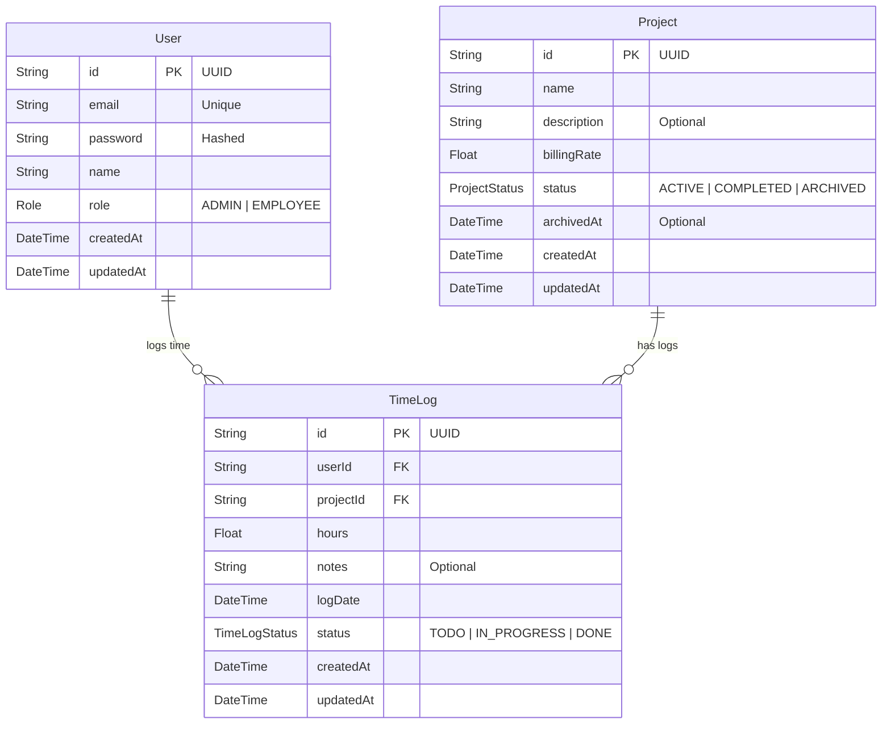

# Entity Relationship Diagram (ERD)

This diagram represents the database schema and relationships for the Project Billing & Time Tracking System.

## Relationships

1.  **User to TimeLog (1:N)**
    - One `User` can create many `TimeLog` entries.
    - Each `TimeLog` belongs to exactly one `User`.

2.  **Project to TimeLog (1:N)**
    - One `Project` can have many `TimeLog` entries associated with it.
    - Each `TimeLog` belongs to exactly one `Project`.
